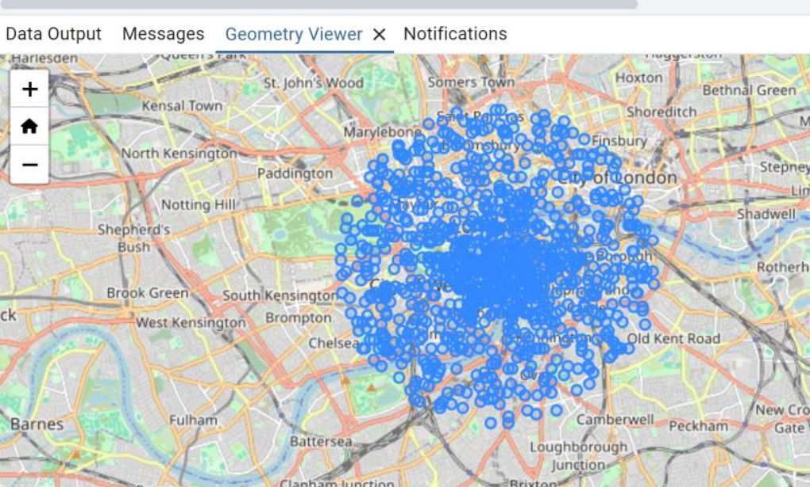

## Location matcher

Experimental location based app that identifies nearby users to a given user and finds common interests between them.

Using: **FastAPI**, **PostgreSQL**, PostGIS extension (adds support
for geographic objects).

Exact locations and interests remain confidential from the server (noise added before sending to server for privacy). example distribution of noisy location 3km around true location:

### Features

- Send location update (authentication required. all sample users are initialized with password=“secret”).
- Find nearby users (authentication required)
- Visualize true location vs. the noisy location of current user.
- 3-step process of finding private set intersection of interests between two nearby users (simple implementation)

### Install

`docker-compose up --build`

`pip install .[client]`

If not using docker: `pip install .[server]`